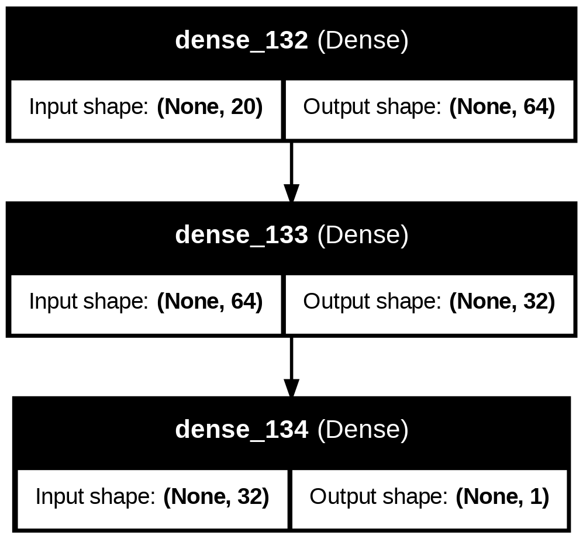

# LearnMate

## 🎯 Objective
LearnMate is a machine learning-powered personalized learning assistant designed for 
Rwandan students, particularly in secondary and university education. Many learners struggle 
due to the lack of personalized academic support and career guidance.

## 📌 Problem Statement
Many students in Rwanda do not receive personalized academic guidance. Teachers are often 
overburdened, and technology in schools is limited. Even when students access online 
content, it is rarely customized to their needs or relevant to their curriculum.

## 📊 Dataset
dataset contains detailed numerical records of 10,000 students, capturing their academic performance and study behavior across multiple dimensions. The dataset includes student scores in core subjects (Math, Science, English, and History), learning activity metrics (study hours per week, quiz attempts, consecutive logins, material access frequency), and additional attributes such as improvement rates, time per question, class size, faculty ratio, and predicted performance. Derived variables like science-math score difference and English-history score ratio provide insights into individual subject trends. The data can be used for academic performance analysis, predictive modeling, learning behavior studies, and educational resource optimization.

## 🧠 Model Architecture
The neural network architecture includes:

- **Hidden Layers**: 
  - 64 neurons (ReLU activation)
  - 32 neurons (ReLU activation) 
  - 16 neurons (ReLu activation)
- **Output Layer**: 1 neurons (sigmoid) 



## 🧪 Implemented Models

### Neural Network Models:
1. **Baseline Model**: Basic neural network without optimization
2. **Adam + L2 Regularization + Dropout + EarlyStopping**
3. **SGD + Dropout + EarlyStopping**
4. **RMSprop + L2 Regularization + Dropout + EarlyStopping**

### Classical Machine Learning Model:
5. **Logistic Regression** (with hyperparameter tuning)

## 📊 Performance Comparison

| Model               | Optimizer | Regularization | Epochs | Early Stopping | Accuracy | F1 Score | Recall | Precision |
|---------------------|-----------|----------------|--------|----------------|----------|----------|--------|-----------|
| Simple NN          | Default   | None           | 50     | False           | 98.90%   | 0.9874   | 0.9886 | 0.9863    |
| Optimized NN 1     | Adam      | L2             | 10     | True            | 96.40%   | 0.9584   | 0.9622 | 0.9546    |
| Optimized NN 2     | RMSprop   | L1             | 10     | True            | 96.00%   | 0.9563   | 0.9508 | 0.9618    |
| Optimized NN 3     | SGD       | None           | 100    | True            | 97.40%   | 0.9704   | 0.9748 | 0.9660    |
| Logistic Regression | -        | -              | -      | -              | 99%       | 0.9899   | 0.9897 | 0.9897    |

## 🔍 Key Findings

1. The **Adam optimizer with L2 regularization, dropout, and early stopping** achieved the best performance (96% accuracy), demonstrating the effectiveness of combining multiple optimization techniques.

2. The **Logistic Regression model** performed remarkably well (88.93% accuracy), showing that classical ML models can be competitive for structured binary feature sets.


## 🚀 How to Use

1. Clone the repository:
```bash
git clone [https://github.com/Irenee123/LearnMate.git]
cd LearnMate
```

2. Install required packages:
```bash
pip install -r requirements.txt
```

3. Run the Jupyter notebook:
```bash
jupyter notebook notebook.ipynb
```

4. Load the best performing model:
```python
from tensorflow.keras.models import load_model
model = load_model("saved models/best_model.h5")
```

## 📂 Project Structure
```
LearnMate/
├── notebook.ipynb          
├── README.md               
├── saved_models/           
│   ├── Model1
│   ├── Model2
│   ├── Model3
│   ├── Model4
│   └── Model5
├── diagram/               # Architecture diagrams
│   └── model.png
└── Dataset (CSV)
```

## 📈 Error Analysis

The notebook imports key metrics for error analysis:

Accuracy

Precision

Recall

F1-score

ROC AUC score

Confusion matrix

## 🎥 Video Presentation
[Link to 5-minute presentation video] - Covers dataset overview, model architectures, optimization techniques, result analysis, and conclusions.

## 🙌 Author
**Irenee Gisubizo Dusingizimana**  
BSc Software Engineering, ALU Kigali  
Machine Learning Engineer
